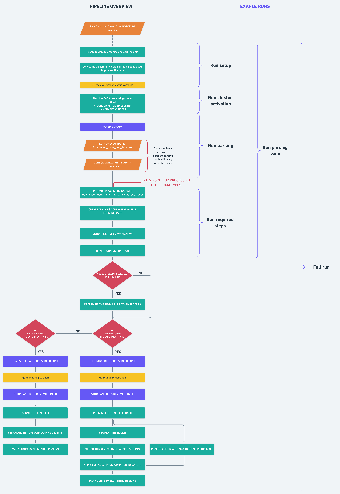

# Table of contents
[Introduction](#Introduction)  
[Installation](#Installation)  
&nbsp;&nbsp;&nbsp;&nbsp;[Install from source](#InstallFromSource)  
&nbsp;&nbsp;&nbsp;&nbsp;[Pip install](#PipInstall)  
[Requirements](#Requirements)  
[EEL/smFISH data life cycle in the Linnarsson Lab](#LifeCycle)  
&nbsp;&nbsp;&nbsp;&nbsp;[Data organisation](#DataOrganisation)  
&nbsp;&nbsp;&nbsp;&nbsp;[Data flow](#DataFlow)  
[pysmFISH processing pipeline requirements](#PipelineRequirements)  
&nbsp;&nbsp;&nbsp;&nbsp;[Setup the processing folder](#SetupProcessingFolder)  
&nbsp;&nbsp;&nbsp;&nbsp;[Experiment configuration file](#ExperimentConfigurationFile)  
&nbsp;&nbsp;&nbsp;&nbsp;[Dataset file](#DatasetFile)  
[Pipeline](#Pipeline)  
&nbsp;&nbsp;&nbsp;&nbsp;[Pipeline running scheme](#PipelineRunningScheme)  
&nbsp;&nbsp;&nbsp;&nbsp;[Overview processing steps](#OverviewProcessingSteps)  
&nbsp;&nbsp;&nbsp;&nbsp;&nbsp;&nbsp;&nbsp;&nbsp;[Create folders step](#CreateFoldersStep)  
&nbsp;&nbsp;&nbsp;&nbsp;&nbsp;&nbsp;&nbsp;&nbsp;[Collect commit step](#CollectCommitStep)  
&nbsp;&nbsp;&nbsp;&nbsp;&nbsp;&nbsp;&nbsp;&nbsp;[QC the experiment-name.config.yaml file](#QCExperimentFilesStep)  
&nbsp;&nbsp;&nbsp;&nbsp;&nbsp;&nbsp;&nbsp;&nbsp;[Start processing cluster](#StartProcessingCluster)    
&nbsp;&nbsp;&nbsp;&nbsp;&nbsp;&nbsp;&nbsp;&nbsp;&nbsp;&nbsp;&nbsp;&nbsp;[Local cluster](#LocalCluster)  
&nbsp;&nbsp;&nbsp;&nbsp;&nbsp;&nbsp;&nbsp;&nbsp;&nbsp;&nbsp;&nbsp;&nbsp;[HTCondor](#HTCondorCluster)  
&nbsp;&nbsp;&nbsp;&nbsp;&nbsp;&nbsp;&nbsp;&nbsp;&nbsp;&nbsp;&nbsp;&nbsp;[Unmanaged cluster](#UnmanagedCluster)  
&nbsp;&nbsp;&nbsp;&nbsp;&nbsp;&nbsp;&nbsp;&nbsp;[Parsing graph step](#ParsingGraph)  
&nbsp;&nbsp;&nbsp;&nbsp;&nbsp;&nbsp;&nbsp;&nbsp;&nbsp;&nbsp;&nbsp;&nbsp;[Parsing introduction](#ParsingIntroduction)  
&nbsp;&nbsp;&nbsp;&nbsp;&nbsp;&nbsp;&nbsp;&nbsp;&nbsp;&nbsp;&nbsp;&nbsp;[Parsing overview processing graph](#ParsingGraphOverview)  
&nbsp;&nbsp;&nbsp;&nbsp;&nbsp;&nbsp;&nbsp;&nbsp;&nbsp;&nbsp;&nbsp;&nbsp;[Parsing graph steps](#ParsingGraphSteps)  
&nbsp;&nbsp;&nbsp;&nbsp;&nbsp;&nbsp;&nbsp;&nbsp;[Prepare processing dataset step](#DatasetStep)  
&nbsp;&nbsp;&nbsp;&nbsp;&nbsp;&nbsp;&nbsp;&nbsp;[Create analysis configuration file from dataset step](#CreateAnalysisConfigStep)  
&nbsp;&nbsp;&nbsp;&nbsp;&nbsp;&nbsp;&nbsp;&nbsp;[Determine tiles organization step](#DetermineTilesOrgStep)  
&nbsp;&nbsp;&nbsp;&nbsp;&nbsp;&nbsp;&nbsp;&nbsp;[Create running functions step](#CreateRunningFunctionsOrgStep)  
&nbsp;&nbsp;&nbsp;&nbsp;&nbsp;&nbsp;&nbsp;&nbsp;[Processing barcoded EEL graph step](#ProcessingBarcodedEELGraphStep)  
&nbsp;&nbsp;&nbsp;&nbsp;&nbsp;&nbsp;&nbsp;&nbsp;&nbsp;&nbsp;&nbsp;&nbsp;&nbsp;&nbsp;&nbsp;&nbsp;[EEL processing steps](#EELProcessingSteps)  
&nbsp;&nbsp;&nbsp;&nbsp;&nbsp;&nbsp;&nbsp;&nbsp;[Remove overlapping dots from data stitched using the microscope coords](#RemoveOverlappingDotsMicroscopeStitched)  
&nbsp;&nbsp;&nbsp;&nbsp;&nbsp;&nbsp;&nbsp;&nbsp;[QC registration error between different rounds of hybridization](#QCRegistrationError)  
&nbsp;&nbsp;&nbsp;&nbsp;&nbsp;&nbsp;&nbsp;&nbsp;[Global stitching and overlapping dots removal](#GlobalStitching)  
&nbsp;&nbsp;&nbsp;&nbsp;&nbsp;&nbsp;&nbsp;&nbsp;&nbsp;&nbsp;&nbsp;&nbsp;&nbsp;&nbsp;&nbsp;&nbsp;[Global stitching graph step](#GlobalStitchingGraphStep)  
&nbsp;&nbsp;&nbsp;&nbsp;&nbsp;&nbsp;&nbsp;&nbsp;&nbsp;&nbsp;&nbsp;&nbsp;&nbsp;&nbsp;&nbsp;&nbsp;[Global stitching dots removal step](#GlobalStitchingDotsRemovalStep)  
&nbsp;&nbsp;&nbsp;&nbsp;&nbsp;&nbsp;&nbsp;[Processing fresh tissue step](#ProcessingFreshTissueStep)  
&nbsp;&nbsp;&nbsp;&nbsp;&nbsp;&nbsp;&nbsp;[Segmentation, registration and generation of cell/gene matrix ](#CellByGeneStep)  
&nbsp;&nbsp;&nbsp;&nbsp;&nbsp;&nbsp;&nbsp;[Processing serial smFISH](#ProcessingSerialsmFISH)  
&nbsp;&nbsp;&nbsp;&nbsp;&nbsp;&nbsp;&nbsp;&nbsp;&nbsp;&nbsp;&nbsp;&nbsp;&nbsp;&nbsp;[Processing serial smFISH steps](#ProcessingSerialSteps)  
[Pipeline runs](#PipelineRuns)  
&nbsp;&nbsp;&nbsp;&nbsp;&nbsp;&nbsp;&nbsp;[run_parsing_only](#run_parsing_only)  
&nbsp;&nbsp;&nbsp;&nbsp;&nbsp;&nbsp;&nbsp;[run_required_steps](#run_required_steps)  
&nbsp;&nbsp;&nbsp;&nbsp;&nbsp;&nbsp;&nbsp;[run_full](#run_full)  
&nbsp;&nbsp;&nbsp;&nbsp;&nbsp;&nbsp;&nbsp;[test_run_after_editing](#test_run_after_editing)  
&nbsp;&nbsp;&nbsp;&nbsp;&nbsp;&nbsp;&nbsp;[test_run_short](#test_run_short)  
&nbsp;&nbsp;&nbsp;&nbsp;&nbsp;&nbsp;&nbsp;[test_run_decoding](#test_run_decoding)  
&nbsp;&nbsp;&nbsp;&nbsp;&nbsp;&nbsp;&nbsp;[test_run_from_registration](#test_run_from_registration)  
&nbsp;&nbsp;&nbsp;&nbsp;&nbsp;&nbsp;&nbsp;[test_run_Lars_mouse_atlas](#test_run_Lars_mouse_atlas)  
[How to run the pipeline](#InteractPipeline)  
&nbsp;&nbsp;&nbsp;&nbsp;&nbsp;&nbsp;&nbsp;[Run with papermill](#RunPapermill)  
&nbsp;&nbsp;&nbsp;&nbsp;&nbsp;&nbsp;&nbsp;[Run with jupyter lab](#RunJupyterLab)  
&nbsp;&nbsp;&nbsp;&nbsp;&nbsp;&nbsp;&nbsp;[Connect to dask dashboard](#DaskDashboard)  
[Jupyter lab notebooks](#JLNotebooks>)  
&nbsp;&nbsp;&nbsp;&nbsp;&nbsp;&nbsp;&nbsp;[Download and organize test data](#TestData)  
&nbsp;&nbsp;&nbsp;&nbsp;&nbsp;&nbsp;&nbsp;[Jupyter lab examples](#Examples)  
&nbsp;&nbsp;&nbsp;&nbsp;&nbsp;&nbsp;&nbsp;&nbsp;&nbsp;&nbsp;&nbsp;&nbsp;&nbsp;&nbsp;[Template running pysmFISH pipeline](#TemplatePipeline)  
&nbsp;&nbsp;&nbsp;&nbsp;&nbsp;&nbsp;&nbsp;&nbsp;&nbsp;&nbsp;&nbsp;&nbsp;&nbsp;&nbsp;[Setup processing environment](#Processing_Env)  
&nbsp;&nbsp;&nbsp;&nbsp;&nbsp;&nbsp;&nbsp;&nbsp;&nbsp;&nbsp;&nbsp;&nbsp;&nbsp;&nbsp;[Create dark image from standalone file](#CreateDarkImage)  
&nbsp;&nbsp;&nbsp;&nbsp;&nbsp;&nbsp;&nbsp;&nbsp;&nbsp;&nbsp;&nbsp;&nbsp;&nbsp;&nbsp;[Local processing cluster activation test](#LocalClusterActivation)  
&nbsp;&nbsp;&nbsp;&nbsp;&nbsp;&nbsp;&nbsp;&nbsp;&nbsp;&nbsp;&nbsp;&nbsp;&nbsp;&nbsp;[Convert excel codebook to parquet](#ConvertExcel)  
&nbsp;&nbsp;&nbsp;&nbsp;&nbsp;&nbsp;&nbsp;&nbsp;&nbsp;&nbsp;&nbsp;&nbsp;&nbsp;&nbsp;[Visualize raw counting](#VizRawCounting)  
&nbsp;&nbsp;&nbsp;&nbsp;&nbsp;&nbsp;&nbsp;&nbsp;&nbsp;&nbsp;&nbsp;&nbsp;&nbsp;&nbsp;[Test filtering and counting](#FiltCount)  
&nbsp;&nbsp;&nbsp;&nbsp;&nbsp;&nbsp;&nbsp;&nbsp;&nbsp;&nbsp;&nbsp;&nbsp;&nbsp;&nbsp;[Process fresh tissue](#ProcessFreshTissue)  
&nbsp;&nbsp;&nbsp;&nbsp;&nbsp;&nbsp;&nbsp;&nbsp;&nbsp;&nbsp;&nbsp;&nbsp;&nbsp;&nbsp;[Stitching counts EEL](#StitchingCountsEEL)  
&nbsp;&nbsp;&nbsp;&nbsp;&nbsp;&nbsp;&nbsp;&nbsp;&nbsp;&nbsp;&nbsp;&nbsp;&nbsp;&nbsp;[Create data for fishScale](#DataFishScale)  
&nbsp;&nbsp;&nbsp;&nbsp;&nbsp;&nbsp;&nbsp;&nbsp;&nbsp;&nbsp;&nbsp;&nbsp;&nbsp;&nbsp;[QC Registration](#QCRegistration)  

# Introduction <a name="Introduction"></a>

`pysmFISH` is a python package used to analyse data generated by the Linnarsson Lab automated systems (called [ROBOFISH](https://github.com/linnarsson-lab/ROBOFISH)).

The data can be analysed on a `local` computer or on a `HPC` cluster. The cluster can be `not managed` or managed by[`HTCondor`](https://research.cs.wisc.edu/htcondor/) and must have a shared file system.

# Installation <a name="Installation"></a>
[Install from source](#InstallFromSource)  
[Pip install](#PipInstall)  

You can install pysmFISH with `pip` or from source

## Install From Source <a name="InstallFromSource"></a>  
__CORRECT THE LINK TO THE PACKAGE__


```bash
# Create your conda env
conda create -n pysmFISH-env python=3.8.5
conda activate pysmFISH-env
pip install --upgrade pip # not always required

# Create the directory that will contain the locally installed copy of the package
mkdir run_code_here
cd run_code_here

# Clone the package
git clone https://github.com/linnarsson-lab/pysmFISH_auto.git

# currently the version

# Install the package
cd pysmFISH_auto
pip install --use-feature=in-tree-build .

# Install the kernel to run with papermill
python -m ipykernel install --user --name pysmFISH-env  --display-name 'pysmFISH-env'
```

## Pip <a name="PipInstall"></a>

```bash
# Create your conda env
conda create -n pysmFISH-env python=3.8.5
conda activate pysmFISH-env

pip install pysmFISH

# Install the kernel to run with papermill
python -m ipykernel install --user --name pysmFISH-env --display-name 'pysmFISH-env'
```

# Requirements <a name="Requirements"></a>

All the requirements are included in the [setup.py](setup.py) file.

# EEL/smFISH data life cycle in the Linnarsson Lab <a name="LifeCycle"></a>
[Data organisation](#DataOrganisation)  
[Data flow](#DataFlow)

## Data organisation for EEL/smFISH data: <a name="DataOrganization"></a>

**ON PREMISES CLUSTER (MONOD)**
The cluster has a shared file system  
Each experiment is labelled with a specific tag and 


__DRIVE 1 (fish)__:  
* __current_folder__: symlink to the storage drive where all the raw data are saved. The data are stored in a different drive that is not backed up but on a RAID  

* __processing_folder__:
  * __experiment_name__: symlink to the experiment to process 
  * __config_db__: contains the configuration files required for start the processing 
  * __codebooks__: contains all the files with the codebooks used in the experiments
  * __probes_sets__: contains all the fasta files with the probes used in the analysis
  * __fish_projects__: contains folders named according to the project. Each folder will contain the symlink to the experiment folders associated to the specific experiment.  

* __preprocessed_data_backup__: contains folder for each experiment with preprocessed data and relevant metadata used for processing. __IMPORTANT__: This folder is backed up in a diffent physical location (ex. outside Karolinska)


__DRIVE 2 (datb)__:  
* sl: parent directory with the data of the `Linnarsson Lab`
The drive is not backed up but is on a `RAID`
  * __fish_rawdata__: Contains all the experiment folders with the fish data.
    * __config_db__: symlink to the config_db folder on `DRIVE 1 (fish)`that contains the configuration files required for start the processing 
    * __codebooks__: symlink to the codebooks folder on `DRIVE 1 (fish)`that contains all the files with the codebooks used in the experiments
    * __probes_sets__: symlink to the config_db folder on `DRIVE 1 (fish)`that contains all the fasta files with the probes used in the analysis
    * __experiment_name__: experiment to process 


__DRIVE N (datN)__:  
* sl: parent directory with the data of the `Linnarsson Lab`
The drive is not backed up but is on a `RAID`
  * __fish_rawdata__: Contains all the experiment folders with the fish data.
    * __config_db__: symlink to the config_db folder on `DRIVE 1 (fish)`that contains the configuration files required for start the processing 
    * __codebooks__: symlink to the codebooks folder on `DRIVE 1 (fish)`that contains all the files with the codebooks used in the experiments
    * __probes_sets__: symlink to the config_db folder on `DRIVE 1 (fish)`that contains all the fasta files with the probes used in the analysis
    * __experiment_name__: experiment to process 


## Data flow <a name="DataFlow"></a>

1. Microscope: The raw data are collected in a folder named according to the experiment
2. The experiment folders containing the raw data are transferred from the microscope to the  `/fish/current_folder` on monod. This is a symlink that point to a `/datX/sl/fish_rawdata` folder on a drive where the raw data are stored. When the drive is full the  `/fish/current_folder` symlink is modified to point to a different drive. **Important:** the `/datX/sl/fish_rawdata` is not backed up but is on a RAID. 
    
    Do not change the symlink while processing some data otherwise the processing will fail because it won't be able to find the data.
    
3. The location of the current folder (ex.  `/datX/sl/fish_rawdata`) must contain symlinks to the  `config_db/ probes_set/ codebooks`  folders in the `fish` drive.

4. The data are processed
6. The preprocessed data and preliminary results are transferred to `/fish/preprocessed_data_backup/Experiment_name` for secure storage together with the metadata required for the processing.
6. The remaining data generated by intermediate steps are deleted

# pysmFISH processing pipeline requirements <a name="PipelineRequirements"></a>

- [Setup the processing folder](#SetupProcessingFolder)
- [Experiment configuration file](#ExperimentConfigurationFile)
- [Dataset file](#DatasetFile)
- If the processing start from parsing raw data generated by a robofish machine a specific set of requirements need to be satisfied (described below)

## Set up the processing folder <a name="SetupProcessingFolder"></a>  

The data and the configuration files must be organised according to the following tree:

__PROCESING FOLDER__:  
__required subfolders__  
- __config_db__: contains the configuration files required for start the processing  
&nbsp;&nbsp;- __analysis_config.yaml__: parameters required for running the analysis.  
&nbsp;&nbsp;- __ROBOFISH1_dark_img.npy__: camera noise images to use for filtering if a camera noise image has not been generated in the specific experiment.  
&nbsp;&nbsp;- __ROBOFISH2_dark_img.npy__  
&nbsp;&nbsp;- __ROBOFISH3_dark_img.npy__  
&nbsp;&nbsp;- __UNDEFINED.npy__ 

- __codebooks__: contains all the files with the codebooks used in the analysis of barcoded experiments  
&nbsp;&nbsp;- __gene_hammming_16_11_6_positive_bits.parquet__  
&nbsp;&nbsp;- __gene_hammming_16_11_6_positive_bits.xslx__  

- __probes_sets__: contains all the fasta files with the probes used in the analysis  
&nbsp;&nbsp;- __HE.fasta__  

__experiments subfolders__  
many experiment folders can be present in the processing folder at each single time  
&nbsp;&nbsp;- __EXP20200922_run_smFISH__: folder with data to process, the details of the organization of the folder with experiments is described below  
&nbsp;&nbsp;- __EXP20200922_run_smFISH_transfer_to_monod_completed.txt__: matching empty text file used to confirm that the data from the machine had been fully transferred to the processing server.


### (1) Create the folder structure

Run the `processing_env->setup_de_novo_env` command inside the processing folder. The output will look like:

- __config_db__: contains the configuration files required for start the processing  
- __codebooks__: contains all the files with the codebooks used in the analysis of barcoded experiments  
- __probes_sets__: contains all the fasta files with the probes used in the analysis  

### (2) Create the general analysis configuration file

Run the `processing_env->create_general_analysis_config` The output will look like:

- __config_db__: contains the configuration files required for start the processing  
&nbsp;&nbsp;- __analysis_config.yaml__: parameters required for running the analysis.  
- __codebooks__: contains all the files with the codebooks used in the analysis of barcoded experiments  
- __probes_sets__: contains all the fasta files with the probes used in the analysis  

### (3) Copy the probes fasta files

Copy the fasta files that will be used in the processing inside the `probes_sets` folder inside the processing folder. Update the folder content with new files when a new probe set is required for the processing. The output will look like:

- __config_db__: contains the configuration files required for start the processing  
&nbsp;&nbsp;- __analysis_config.yaml__: parameters required for running the analysis.  
- __codebooks__: contains all the files with the codebooks used in the analysis of barcoded experiments  
- __probes_sets__: contains all the fasta files with the probes used in the analysis  
&nbsp;&nbsp;- __HE.fasta__


### (4) Create the processing codebook

The reference codebooks are generated as `.xlsx` files with the following columns:

`Barcode, Index, Group, Fluorophore, Tail1, Tail2, Tail3, Tail4, Tail5, Tail6, Gene, Pool`. First copy the `.xlsx` file into the `codebooks` folder then run the conversion command `processing_env->convert_codebook` The processing codebook will have only the `Barcode, Gene` columns and will be stored as `.parquet` file. The barcode is stored as bytes (``np.int8`) in the parquet file. The output will look like:
 
- __config_db__: contains the configuration files required for start the processing  
&nbsp;&nbsp;- __analysis_config.yaml__: parameters required for running the analysis.  
- __codebooks__: contains all the files with the codebooks used in the analysis of barcoded experiments  
&nbsp;&nbsp;- __gene_hammming_16_11_6_positive_bits.parquet__  
&nbsp;&nbsp;- __gene_hammming_16_11_6_positive_bits.xslx__  
- __probes_sets__: contains all the fasta files with the probes used in the analysis  
&nbsp;&nbsp;- __HE.fasta__  

### (5) Save the dark image reference file

The dark image file is acquired at the end of the experiment as `.nd2` file labeled `Blank*.nd2`. The processing functions will use this file for the analysis. However, if the file has not been acquired is **necessary** to have a `MACHINE-NAME_dark_img.npy` file in the `config_db` folder. Therefore save a copy of an already generated dark image for each of the machines that will generate data inside the `config_db` folder. The output will look like:

- __config_db__: contains the configuration files required for start the processing  
&nbsp;&nbsp;- __analysis_config.yaml__: parameters required for running the analysis.  
&nbsp;&nbsp;- __ROBOFISH1_dark_img.npy__: camera noise images to use for filtering if a camera noise image has not been generated in the specific experiment.  
&nbsp;&nbsp;- __ROBOFISH2_dark_img.npy__  
&nbsp;&nbsp;- __ROBOFISH3_dark_img.npy__  
&nbsp;&nbsp;- __UNDEFINED.npy__ 

- __codebooks__: contains all the files with the codebooks used in the analysis of barcoded experiments  
&nbsp;&nbsp;- __gene_hammming_16_11_6_positive_bits.parquet__  
&nbsp;&nbsp;- __gene_hammming_16_11_6_positive_bits.xslx__  

- __probes_sets__: contains all the fasta files with the probes used in the analysis  
&nbsp;&nbsp;- __HE.fasta__ 


### (6) Transfer the experiment folder into the processing folder

The folder containing the data to process must be moved in the processing folder. This is independent from the status of the processing.

__EXAMPLE__  
Structure of an experimental folder generated by ROBOFISH. It is a two color channels (Cy5/Cy3) eel experiment using Europium as reference channel


__Reference images collecte at 10X and 40X__:

- Reference Nuclei 10X  
20210613_175632_037__ChannelCy3_Nuclei_Seq0000.nd2

- Reference nuclei images 40X  
20210613_175632_037__ChannelCy3_Nuclei_Seq0001.nd2

- Reference Europium beads images 40X   
20210613_175632_037__ChannelEuropium_Cy3_Seq0002.nd2  

__Rounds images (1 file/channel with all FOVs)__:  
_Count0000X must be present in the name_  
20210615_231228_197__Count00001_ChannelCy3_Seq0002.nd2  
20210615_231228_197__Count00001_ChannelCy5_Seq0000.nd2  
20210615_231228_197__Count00001_ChannelEuropium_Seq0001.nd2  
20210615_231228_197__Count00002_ChannelCy3_Seq0005.nd2  
20210615_231228_197__Count00002_ChannelCy5_Seq0003.nd2  
20210615_231228_197__Count00002_ChannelEuropium_Seq0004.nd2  
20210615_231228_197__Count00003_ChannelCy3_Seq0008.nd2  
20210615_231228_197__Count00003_ChannelCy5_Seq0006.nd2  
20210615_231228_197__Count00003_ChannelEuropium_Seq0007.nd2  
20210615_231228_197__Count00004_ChannelCy3_Seq0011.nd2  
20210615_231228_197__Count00004_ChannelCy5_Seq0009.nd2  
20210615_231228_197__Count00004_ChannelEuropium_Seq0010.nd2  
20210615_231228_197__Count00005_ChannelCy3_Seq0014.nd2  
20210615_231228_197__Count00005_ChannelCy5_Seq0012.nd2  
20210615_231228_197__Count00005_ChannelEuropium_Seq0013.nd2  
20210615_231228_197__Count00006_ChannelCy3_Seq0017.nd2  
20210615_231228_197__Count00006_ChannelCy5_Seq0015.nd2  
20210615_231228_197__Count00006_ChannelEuropium_Seq0016.nd2  
20210615_231228_197__Count00007_ChannelCy3_Seq0020.nd2  
20210615_231228_197__Count00007_ChannelCy5_Seq0018.nd2  
20210615_231228_197__Count00007_ChannelEuropium_Seq0019.nd2  
20210615_231228_197__Count00008_ChannelCy3_Seq0023.nd2  
20210615_231228_197__Count00008_ChannelCy5_Seq0021.nd2  
20210615_231228_197__Count00008_ChannelEuropium_Seq0022.nd2  
20210615_231228_197__Count00009_ChannelCy3_Seq0026.nd2  
20210615_231228_197__Count00009_ChannelCy5_Seq0024.nd2  
20210615_231228_197__Count00009_ChannelEuropium_Seq0025.nd2  
20210615_231228_197__Count00010_ChannelCy3_Seq0029.nd2  
20210615_231228_197__Count00010_ChannelCy5_Seq0027.nd2  
20210615_231228_197__Count00010_ChannelEuropium_Seq0028.nd2  
20210615_231228_197__Count00011_ChannelCy3_Seq0032.nd2  
20210615_231228_197__Count00011_ChannelCy5_Seq0030.nd2  
20210615_231228_197__Count00011_ChannelEuropium_Seq0031.nd2  
20210615_231228_197__Count00012_ChannelCy3_Seq0035.nd2  
20210615_231228_197__Count00012_ChannelCy5_Seq0033.nd2  
20210615_231228_197__Count00012_ChannelEuropium_Seq0034.nd2  
20210615_231228_197__Count00013_ChannelCy3_Seq0038.nd2  
20210615_231228_197__Count00013_ChannelCy5_Seq0036.nd2  
20210615_231228_197__Count00013_ChannelEuropium_Seq0037.nd2  
20210615_231228_197__Count00014_ChannelCy3_Seq0041.nd2  
20210615_231228_197__Count00014_ChannelCy5_Seq0039.nd2  
20210615_231228_197__Count00014_ChannelEuropium_Seq0040.nd2  
20210615_231228_197__Count00015_ChannelCy3_Seq0044.nd2  
20210615_231228_197__Count00015_ChannelCy5_Seq0042.nd2  
20210615_231228_197__Count00015_ChannelEuropium_Seq0043.nd2  
20210615_231228_197__Count00016_ChannelCy3_Seq0047.nd2  
20210615_231228_197__Count00016_ChannelCy5_Seq0045.nd2  
20210615_231228_197__Count00016_ChannelEuropium_Seq0046.nd2  

__Configuration files matching the round images__:  
Count00001_JJEXP20210613_SL001_Section1_C1H01.pkl  
Count00002_JJEXP20210613_SL001_Section1_C1H02.pkl  
Count00003_JJEXP20210613_SL001_Section1_C1H03.pkl  
Count00004_JJEXP20210613_SL001_Section1_C1H04.pkl  
Count00005_JJEXP20210613_SL001_Section1_C1H05.pkl  
Count00006_JJEXP20210613_SL001_Section1_C1H06.pkl  
Count00007_JJEXP20210613_SL001_Section1_C1H07.pkl  
Count00008_JJEXP20210613_SL001_Section1_C1H08.pkl  
Count00009_JJEXP20210613_SL001_Section1_C1H09.pkl  
Count00010_JJEXP20210613_SL001_Section1_C1H10.pkl  
Count00011_JJEXP20210613_SL001_Section1_C1H11.pkl  
Count00012_JJEXP20210613_SL001_Section1_C1H12.pkl  
Count00013_JJEXP20210613_SL001_Section1_C1H13.pkl  
Count00014_JJEXP20210613_SL001_Section1_C1H14.pkl  
Count00015_JJEXP20210613_SL001_Section1_C1H15.pkl  
Count00016_JJEXP20210613_SL001_Section1_C1H16.pkl  

__Experiment configuration file__:  
JJEXP20210613_SL001_Section1_config.yaml (see below for content and required
content)

__Images of the crosses used to register the slide after EEL__:  
Left_cross.nd2  
Right_cross.nd2  

__Coords of the acquired fovs__  
- Coords of initial grid of FOVS (multipoints_775.xml)  
- Add to the coords of the crosses to the initial grid (multipoints_775_Crosses.xml)  
- Correct the coords after registration of the crosses (multipoints_775_Crosses_Adjusted.xml)  
- Removed extra fovs (multipoints_631_Final.xml)  

__ROBOFISH logs__
2021-Jun-15_17-58-05_ROBOFISH2.log
2021-Jun-15_21-24-21_ROBOFISH2.log

### Example of .pkl config file content

```python
# Count00014_JJEXP20210613_SL001_Section1_C1H14.pkl

{'round_code': 'C1H14',
 'experiment_name': 'JJEXP20210613_SL001_Section1',
 'Description': 'GBM SL001 with HG1 and HG2 pools',
 'Protocols_io': 'https://www.protocols.io/edit/eel-t92er8e',
 'chamber': 'chamber1',
 'Machine': 'ROBOFISH2',
 'Operator': 'operator4',
 'Timestamp_robofish': '2021-06-18 13-09-14',
 'hybridization_fname': 'Unknown-at-dict-generation-time',
 'hybridization_number': 14,
 'Hyb_time_A': 0.16,
 'Hyb_time_B': 'None',
 'Hyb_time_C': 'None',
 'Hybmix_volume': 500,
 'Imaging_temperature': 20.0,
 'Fluidic_Program': 'EEL_barcoded',
 'Readout_temperature': 22.0,
 'Staining_temperature': 37.0,
 'Start_date': '20210613',
 'Target_cycles': 16,
 'Species': 'Homo sapiens',
 'Sample': 'SL001',
 'Strain': 'None',
 'Age': 'None',
 'Tissue': 'Glioblastoma',
 'Orientation': 'None',
 'RegionImaged': 'None',
 'SectionID': 'None',
 'Position': 'None',
 'Experiment_type': 'eel-barcoded',
 'Chemistry': 'EELV2_corev2',
'Probes_FASTA': {
  'Probes_Atto425': 'None',
  'Probes_Cy3': 'HG2.fasta',
  'Probes_Cy5': 'HG2.fasta',
  'Probes_Cy7': 'None',
  'Probes_DAPI': 'None',
  'Probes_FITC': 'None',
  'Probes_TxRed': 'None',
	'Probes_Europium': 'None'},
 'Barcode': 'True',
 'Barcode_length': 16,
 'Codebooks': {
	 'Codebook_DAPI': 'None',
	 'Codebook_Atto425': 'None',
	 'Codebook_FITC': 'None',
	 'Codebook_Cy3': 'codebookHG2_20210508.parquet',
	 'Codebook_TexasRed': 'None',
	 'Codebook_Cy5': 'gene_hGBM20201124.parquet',
	 'Codebook_Cy7': 'None',
	 'Codebook_Europium': 'None'},
 'Multicolor_barcode': 'False',
 'Stitching_type': 'both-beads',
 'StitchingChannel': 'Europium',
 'Overlapping_percentage': '8',
 'channels': {'Code': 'C1H14',
  'Chamber': 1,
  'Hybridization': 'Hybridization14',
  'DAPI': 'None',
  'Atto425': 'None',
  'FITC': 'None',
  'Cy3': 'EELCy3-14',
  'TxRed': 'None',
  'Cy5': 'EEL647-14',
  'Cy7': 'None',
  'QDot': 'None',
  'BrightField': 'None',
  'Europium': 'Europium'},
 'roi': '[[0, 529]]',
 'Pipeline': 'eel-human-GBM',
 'system_log': 'log_files/2021-Jun-15_21-24-21_ROBOFISH2.log'}
```

## Experiment configuration file <a name="ExperimentConfigurationFile"></a>

In order to be able to process each experiment folder must contain a documentation file: `Experiment_Name_auto_config.yaml` If the data are generated by a ROBOFISH machine the experiment configuration file will be automatically generated and included in the experiment folder. If the data are generated by another instrument a minimal working configuration file can be manually created.

### Example of experiment configuration file

```yaml

# JJEXP20210613_SL001_Section1_config.yaml

Age: None
Barcode: 'True'
Barcode_length: 16
Chamber_EXP: Chamber1
Chemistry: EELV2_corev2

# One codebook for each channel
# key is Codebook_+ channel name 
# NB: use the channel name and not the optical config name
Codebooks:
  Codebook_Atto425: None
  Codebook_Cy3: codebookHG2_20210508.parquet
  Codebook_Cy5: gene_hGBM20201124.parquet
  Codebook_Cy7: None
  Codebook_DAPI: None
  Codebook_FITC: None
  Codebook_TexasRed: None 
  Codebook_Europium: None

Description: GBM SL001 with HG1 and HG2 pools
EXP_name: JJEXP20210613_SL001_Section1

# Experiment type can be:
# eel-barcoded
# serial-smfish
Experiment_type: eel-barcoded

Heatshock_temperature: 22.0
Hyb_time_1_A: 0.16
Hyb_time_1_B: None
Hyb_time_1_C: None
Hyb_time_2_A: None
Hyb_time_2_B: None
Hyb_time_2_C: None
Hybmix_volume: 500
Imaging_temperature: 20.0

# Machine can be: 
# ROBOFISH1 
# ROBOFISH2
# ROBOFISH3
# NOT_DEFINED
Machine: ROBOFISH2

# Bool
Multicolor_barcode: 'False'

Operator: operator4
Orientation: None
Overlapping_percentage: '8'

# A pipeline is define as a dictionary of predefined
# function to run in the preprocessing and dots calling
# steps
# Can be one of the built-in pipeline
# Other pipelines can be added in the package in the
# pysmFISH.configuration_files.create_function_runner
# The current available pipelines are
# eel-human-embryo
# eel-human-GBM
# eel-human-adult-brain
# eel-mouse-brain
# smfish-serial-adult-human
# smfish-serial-mouse
# smfish-serial-controls-eel
Pipeline: eel-human-GBM

Position: None
Probes_FASTA:
  Probes_FASTA_Atto425: None
  Probes_FASTA_Cy3: HG2.fasta
  Probes_FASTA_Cy5: HG2.fasta
  Probes_FASTA_Cy7: None
  Probes_FASTA_DAPI: None
  Probes_FASTA_FITC: None
  Probes_FASTA_TxRed: None
  Probes_FASTA_Europium: None
Program: EEL_barcoded
Protocols_io: https://www.protocols.io/edit/eel-t92er8e
Readout_temperature: 22.0
RegionImaged: None
Sample: SL001
SectionID: None
Species: Homo sapiens
Staining_temperature: 37.0
Start_date: '20210613'

# Currently process Europium or DAPI
StitchingChannel: Europium

# Define the type of reference channel used 
# for registering the FOVs in different rounds and
# stitch the entire experiment
# can be:
# small-beads
# large-beads
# both-beads
# nuclei
Stitching_type: both-beads
Strain: None
Stripping_temperature: 22.0
Target_cycles: 16
Tissue: Glioblastoma
roi: '[[0, 529]]'
```

### Minimal version of experiment config file

```yaml
# Minimal working experiment configuration file

Barcode: 'True'
Barcode_length: 16
Chemistry: EELV2_corev2

# One codebook for each channel
# key is Codebook_+ channel name 
# NB: use the channel name and not the optical config name
Codebooks:
  - Codebook_Atto425: None
  - Codebook_Cy3: codebookHG2_20210508.parquet
  - Codebook_Cy5: gene_hGBM20201124.parquet
  - Codebook_Cy7: None
  - Codebook_DAPI: None
  - Codebook_FITC: None
  - Codebook_TexasRed: None

EXP_name: LBEXP20210428_EEL_HE_3370um
Start_date: '20210428'

# Experiment type can be:
# eel-barcoded
# serial-smfish
Experiment_type: eel-barcoded

# Machine can be: 
# ROBOFISH1 
# ROBOFISH2
# ROBOFISH3
# NOT_DEFINED
Machine: ROBOFISH2

Operator: lars
Orientation: Sagittal

Overlapping_percentage: '8'

# A pipeline is define as a dictionary of predefined
# function to run in the preprocessing and dots calling
# steps
# Can be one of the built-in pipeline
# Other pipelines can be added in the package in the
# pysmFISH.configuration_files.create_function_runner
# The current available pipelines are
# eel-human-embryo
# eel-human-GBM
# eel-human-adult-brain
# eel-mouse-brain
# smfish-serial-adult-human
# smfish-serial-mouse
# smfish-serial-controls-eel

Pipeline: eel-human-embryo

# NB: use the channel name and not the optical config name
Probes_FASTA:
  Probes_FASTA_Atto425: None
  Probes_FASTA_Cy3: HG2.fasta
  Probes_FASTA_Cy5: HG2.fasta
  Probes_FASTA_Cy7: None
  Probes_FASTA_DAPI: None
  Probes_FASTA_FITC: None
  Probes_FASTA_TxRed: None

# Define the type of reference channel used 
# for registering the FOVs in different rounds and
# stitch the entire experiment
# can be:
# small-beads
# large-beads
# both-beads
# nuclei
Stitching_type: both-beads

# Currently process Europium or DAPI
StitchingChannel: Europium

# Bool
Multicolor_barcode: 'False'

Species: Homo sapiens
Age: 7W1D PCA
Strain: None
Tissue: Head
```

## Dataset File <a name="Dataset File"></a>

The dataset ( **XXX** **add link to location of an example dataset XXX**) is a pandas data frame containing all the metadata corresponding to a specific field of view. In experiment generated by `ROBOFISH` machines the dataset is automatically generated. 

The dataset contains all the metadata parsed from the ``.nd2` files, the matching `.pkl` files and the `experiment-name_config.yaml`. This facilitate the reprocessing of the images because all information for processing are saved in one single file  

The dataset is created using the `Dataset` class of the `data_models` module. The Dataset is created by collecting the metadata from the `.zmetadata` aggregated `.json` file of the `zarr` container with the parsed raw data. If the `.zmetadata`file is not available but the field of views related metadata are saved in single files is possible to build the `Dataset` using the `Dataset.create_full_dataset_from_files` utility function. The function currently support only `.pkl` files but can be expanded to combine different file types.

The dataset contains the following experimental info:

```yaml
# Experiment related properties
experiment_name
experiment_type
probe_fasta_name
total_fovs

# Sample related properties
species
strain
tissue

# Data generator related properties
operator
machine
start_date

# FOV related properties
fov_name
channel
round_num
target_name
fov_acquisition_coords_x
fov_acquisition_coords_y
fov_acquisition_coords_z
img_height
img_width
overlapping_percentage
pixel_microns
zstack # Number of z-planes

# Processing related properties
barcode # True or False
barcode_length
codebook
pipeline
processing_type
stitching_channel
stitching_type

# Data storage related properties
grp_name # zarr group name of raw data
raw_data_location
```

# Pipeline <a name="Pipeline"></a>

The `pipeline` module contains the classes used to run processing pipelines. Currently there is only one class (`Pipeline`) that can be used to process `eel` and `smfish` data. 

## Pipeline class overview running scheme <a name="PipelineRunningScheme"></a>




## Overview of the processing steps <a name="OverviewProcessingSteps"></a>

### Create folders step <a name="CreateFoldersStep"></a>

Create the folder structure used for the data processing. If a folder is already present it won't overwrite it.

__FOLDER STRUCTURE:__  

__codebook__: contain the codebooks used for the analysis.  
__original_robofish_logs__: contains all the original robofish logs.  
__extra_files__: contains the extra files acquired during imaging.  
__extra_processing_data__: contains extra files used in the analysis like the dark images for flat field correction.  
__pipeline_config__: contains all the configuration files.  
__raw_data__: contains the renamed .nd2 files and the corresponding .pkl metadata files.  
__output_figures__: contains the reports and visualizations-  
__notebooks__: contain potential notebooks used for processing the data.  
__probes__: contains the fasta file with the probes used in the experiment.  
__fresh_tissue__: contain the images and the process data obtained from imaging the fresh tissue before eel processing.  
__logs__: contains the dask and htcondor logs.  
__microscope_tiles_coords__: contain the coords of the FOVs according to the microscope stage.  
__results__: contains all the processing results.  


### Collect git commit step <a name="CollectCommitStep"></a>

Collect the hash corresponding to version of the pipeline used to process the data. The output is saved in a `git_info.yaml` file in the `results` folder. Run on 1 CPU on the main node.

### QC the experiment-name_config.yaml step <a name="QCExperimentFilesStep"></a>

This step make sure that the content of the `experiment-name_config.yaml` file is complete. This file contains metadata required for the processing. Run on 1 CPU on the main node.

### Start the processing cluster step <a name="StartProcessingCluster"></a>

In order to be able to process large data in a feasible amount of time we parallelised a lot of the steps of the pipeline. To scale out processing we are using [dask](https://dask.org/). Dask will take care of the scheduling and distributing the workload to workers. The workers can be on the same machine or on different computational units. We decided to used dask because it is able to run locally, on our on-premises cluster or on the cloud. We currently run dask using CPUs and not threads.

- **LOCAL:** <a name="LocalCluster"></a>  
When running locally the pipeline use:

    ```yaml
    number_cpus: Defined in the pipeline parameters
    memory_limit:Defined in the pipeline parameters
    processes: True
    threads_per_worker: 1
    ```
    

- **HTCONDOR:**  <a name="HTCondorCluster"></a>
  The workload on our cluster is managed by [htcondor](https://research.cs.wisc.edu/htcondor/). The cluster has a shared file system. In order to facilitate the creation of a dask cluster on top of htcondor we use [dask-jobqueue](https://jobqueue.dask.org/en/latest/).
    
  The values of the parameters for setting up dask on our cluster is strictly dependent on the configuration of our htcondor installation.
    
  We use an adaptable cluster (increase/decrease size depending on the load) with a minimum of 1 to a maximum of 15 jobs (NB: in dask-jobqueue terminology jobs=workers). Each of the jobs can have a custom defined number of cores. In our setup the default number is 20 and the total memory for all the workers is 200GB.
    
  Summary:
      
    ```yaml
      jobs (workers): 1:15
      cores / worker: 20
      RAM / worker: 200 GB
      cluster.scheduler.allowed_failures : 1000
    ```
  By specifying these parameter we override the standard configuration files that are written in the processing machine after installation. To better understand the standard configuration refer to the following doc page: [dask configuration docs](https://docs.dask.org/en/latest/configuration.html).  We included a copy of our configuration files in the code repository `pysmFISH/docs/dask-general-config-files`  
    
  **IMPORTANT**
  During our data processing we noted that is the processes run for too long (ex. blocking the GIL for a long time) the probability to loose connection between dask scheduler and workers is quite high. This results in an hanged or crushed processing. To avoid the issue is better to combine the long processing steps in chunks. In our particular case the issue surface when processing the different FOVs. Therefore instead of building an eel-processing-graph which process all the FOVs we first chunk the FOVs in group (usually 40-50 FOVs in 1 channel eel 16 bits experiments) and then build and process a graph for each chunk.
    
- **Unmanaged Cluster:**  <a name="UnmanagedCluster"></a>
Use a cluster where jobs submission is controlled by a workload manager (ex. HTCondor, SLURM,PBS). Jobs scheduling is done using [SSHCluster](https://docs.dask.org/en/stable/how-to/deploy-dask/ssh.html) from dask. The parameters used for setting up the SSHCluster are strictly dependent on the configuration of the unamanaged cluster available. 

  Example settings for MONOD:
  Currenlty in MONOD four nodes are not managed by HTCondor (monod10, monod11, monod12, monod33). In our current setup the main node host the scheduler. It is possible to host the scheduler on a node as well.
      
    ```yaml
      nprocs: 40
      memory: "6GB",
      nthreads: 1
      scheduler_port: 23875
      dashboard_port: 25399
      scheduler_address: 'localhost'
      workers_addresses_list = ['monod10','monod11','monod12','monod33']
    ```

  __IMPORTANT__:
  Because of a bug in the SSHCluster is not enough to shut down the cllient and the cluster objects
  ```python
    running_pipeline_name.client.close()
    running_pipeline_name.cluster.close()
  ````
  but the processes must be killed using the [processing_cluster_setup.kill_process()](https://github.com/linnarsson-lab/pysmFISH_auto/blob/27f371e3bd2cd73aa7c598132ae9416c6c06467b/pysmFISH/processing_cluster_setup.py#L124) function

  ```python
    running_pipeline_name.client.close()
    running_pipeline_name.cluster.close()
    if running_pipeline_name.processing_engine == 'unmanaged_cluster':
            processing_cluster_setup.kill_process()
  ````
  If the processing fails and the cluster doesn't get kill you need to manually shut it down

  ```bash
  # In the main node list the dask distributed processe
  ps -fA | grep distributed.cli.dask.scheduler
  kill process-number

  # for each of the nodes used ssh into the node and kill all the python processes
  pkill -f python
  ```

  __NOTE__:
  When using an unmanaged cluster is possible to reuse the cluster for additional processing. You need to pass the dask.scheduler address to the `scheduler_address` parameter when a pipeline is initialized. 


### Parsing graph step <a name="ParsingGraph"></a>

**Introduction** <a name="ParsingIntroduction"></a>

The goal of the parsing step is to convert the raw `.nd2` files acquired by the microscope that cannot be accessed in parallel into a format more parallel friendly and with better compression. We decided to use [zarr](https://zarr.readthedocs.io/en/stable/). The parsing output a zarr container `experiment-name_parsed-image-tag.zarr` such as `LBEXP20210718_EEL_Mouse_448_2_img_data.zarr`. The `zarr`file contains a group for each of the FOVs/round of hybridization/channell position. Each group contains a dataset with the raw image stack. The dataset is chunked along the z-dimension `chunk=(1,img.shape[0],img.shape[1])`. The parsed metadata are stored in the `.zattrs` `.json` file associated to the dataset.

The graph is built using [`dask.delayed`](https://docs.dask.org/en/latest/delayed.html)

Parsed raw data file structure  

File Name: __LBEXP20210718_EEL_Mouse_448_2_img_data.zarr__
- Group name __LBEXP20210718_EEL_Mouse_448_2_Hybridization01_Cy5_fov_10__  
  - Dataset name: __raw_data_fov_10__:
  - File related metadata parsed from .nd2: __.zattrs__
- Group name __LBEXP20210718_EEL_Mouse_448_2_Hybridization01_Cy5_fov_21__  
  - Dataset name: __raw_data_fov_21__:
  - File related metadata parsed from .nd2: __.zattrs__


**Overview of the processing graph** <a name="ParsingGraphOverview"></a>


**Parsing graph steps** <a name="ParsingGraphSteps"></a>

Parsing types: 
- **no_parsing:** skip the parsing step
- **original:** parse the files originated by ROBOFISH,  rename the original and store them in the `raw_data` subfolder
- **reparsing_from_processing_folder:** reparse the renamed raw files stored in the `raw_data` subfolder still in the experiment folder
- **reparsing_from_storage:** reparse the renamed raw files stored in the `raw_data`subfolder after the raw_data has been moved to storage

**Parsing original files:**

- __Collect all processing files__: Gather codebooks and probes from the storage folders
- __Sort data into folders__: Sort the files created by ROBOFISH in subfolders
- __Select raw data__:  Identify the nd2 raw microscopy files generated by the robofish machine. 
__important__: The files must contain `CountXXXXX` in the name.

- __QC_matching_nd2_metadata_robofish__: This function is used to check that each of the nd2 files generated by the microscope has a matching pkl metadata file generated by robofish
- __Parse .nd2 files__: This function is prallelised. Each .nd2 files is processed by a different CPU and the output is written in the same `zarr` file container. The metadata related to the imaging and stored in the .nd2 files are also collected during the parsing.
- __Consolidate the zarr metadata__: Each dataset in the zarr container has the metadata stored in a `.zattrs` files. In order to accelerate the access to the information contained in this files all the metadata are combined in a single `.json` file named `.zmetadata` and stored in the zarr container.

**Reparsing from processing_folder/storage:**

- __Define the raw data folder__: In order to reparse the data you need to identify the location of  parsed and renamed raw_data folder.
- __Select renamed raw data__: Function used to identify the .nd2 files in a folder. The files do not need to have the CountXXX.

## Prepare processing dataset step <a name="DatasetStep"></a>

The [dataset]() is a pandas dataframe that contains all the metadata for each field of view parsed from the `.nd2` files, the matching `.pkl` files and the `experiment-name_config.yaml` file. This facilitate the reprocessing of the images because all information for processing are saved in one single file. The dataset dataframe match the organisation of the parsed images zarr container. A subset of metadata common to all the fovs is stored in the metadata attribute.

```yaml
metdata:
- list_all_fovs
- list_all_channels
- total_rounds
- stitching_channel
- img_width
- img_height
- img_zstack
- pixel_microns
- experiment_name
- overlapping_percentage
- machine
- barcode_length
- processing_type
- experiment_type
- pipeline
- stitching_type
- list_all_codebooks
```

## Create analysis configuration file from dataset step <a name="CreateAnalysisConfigStep"></a>

Load or create the `analysis_config.yaml` file with all the parameters for running the analysis. It will first load the analysis_config.yaml file present in the `pipeline_config folder`. If not it will create one using the master template stored in the `config_db` directory selecting the parameters according to the `Machine`and `Experiment_type` info present in the dataset file.

Example of analysis_config.yaml file for the processing of a eel-barcoded experiment of a human sample

```yaml
fish:
  PreprocessingFishFlatFieldKernel:
  - 1
  - 100
  - 100
  PreprocessingFishFilteringSmallKernel:
  - 1
  - 8
  - 8
  PreprocessingFishFilteringLaplacianKernel:
  - 0.02
  - 0.01
  - 0.01
  CountingFishMinObjDistance: 1
  CountingFishMaxObjSize: 200
  CountingFishMinObjSize: 1
  CountingFishNumPeaksPerLabel: 20
  LargeObjRemovalPercentile: 95
  LargeObjRemovalMinObjSize: 100
  LargeObjRemovalSelem: 3
both-beads:
  PreprocessingFishFilteringSmallKernel:
  - 1
  - 8
  - 8
  PreprocessingFishFilteringLaplacianKernel:
  - 0.02
  - 0.01
  - 0.01
  PreprocessingFishFlatFieldKernel:
  - 1
  - 100
  - 100
  CountingFishMinObjDistance: 5
  CountingFishMaxObjSize: 600
  CountingFishMinObjSize: 10
  CountingFishNumPeaksPerLabel: 1
  LargeObjRemovalPercentile: 95
  LargeObjRemovalMinObjSize: 100
  LargeObjRemovalSelem: 3
staining:
  PreprocessingStainingFlatFieldKernel:
  - 2
  - 100
  - 100
fresh-tissue:
  nuclei:
    PreprocessingFreshNucleiLargeKernelSize:
    - 5
    - 50
    - 50
  beads:
    PreprocessingFishFlatFieldKernel:
    - 100
    - 100
    CountingFishMinObjDistance: 2
    CountingFishMaxObjSize: 200
    CountingFishMinObjSize: 2
    CountingFishNumPeaksPerLabel: 1
BarcodesExtractionResolution: 2
RegistrationReferenceHybridization: 1
RegistrationTollerancePxl: 3
RegistrationMinMatchingBeads: 5
```

 

## Determine tiles organisation step <a name="DetermineTilesOrgStep"></a>

This step is used to determine how the field of views are organised in the imaged region and to identify the coords of the overlapping regions between the tiles. The stage based coords are then normalised to an image-notation (numpy matrix notation) in which the top-left corner of the image is the origin (0,0), the x-axis goes left→right (columns of the numpy matrix) and the y-axis goes top→bottom (rows of the numpy matrix). The process of normalisation depend on the stage and the camera orientation in the machine. The coords systems of the machines used in the Linnarsson lab are different.  


The identification of the organisation of the fovs in the composite image can be simplified if the (0,0) coords of the stage/camera will be set to the same position for all machines. In our case we started running experiments with the coords not adjusted and that's why the position of (0,0) is different for all the machine that are used to generate the data.

It is possible to assign a specified orientation in the camera tab of the NIS element.

The tile organisation is saved as `image_space_tiles_organization.png` in the `output_figures` subfolder.


### If you have different stage coords than the one of the Linnarsson lab machine

Modify the `pysmFISH.stitching.organize_square_tile`  `normalize_coords` method. The easiest way is to add the normalisation function to the `NON_DEFINED` machine. Otherwise add your machine name (the same name of the machine included in [experiment_config.yaml file]())

## Create running functions step <a name="CreateRunningFunctionsOrgStep"></a>

The `pysmFISH` pipeline is used to run analysis of a variety of samples. Each type of tissue and/or organism (mouse vs. human) show different properties such as background fluorescence or presence of [lipofuscin](https://en.wikipedia.org/wiki/Lipofuscin). Therefore the images and the dots calling are done using different methodologies. In addition, different type of reference images for image registration can be used. We are currently support:  `nuclei` (for smFISH-serial) or [`Europium`](https://en.wikipedia.org/wiki/Europium) beads (small 200 nm and large 1 $um$)  `small-beads, large-beads, both-beads` for both eel and smFISH experiments.

The running functions are combined into a dictionary with the following structure:

```python
 {processing step name: processing function name}
```

example of running dictionary:

```python
running_functions = { 
		'fish_channels_preprocessing':'filter_remove_large_objs',
    'fish_channels_dots_calling':'osmFISH_peak_based_detection_fast',
    'fresh_sample_reference_preprocessing':'large_beads_preprocessing',
    'fresh_sample_reference_dots_calling':'osmFISH_peak_based_detection_fast',
    'fresh_sample_nuclei_preprocessing':'fresh_nuclei_filtering'}
```

In order to run a specific function we use the `[getattr()](https://docs.python.org/3/library/functions.html#getattr)` python built-in function

example:

```python
running_functions = { 
		'fish_channels_preprocessing':'filter_remove_large_objs',
    'fish_channels_dots_calling':'osmFISH_peak_based_detection_fast',
    'fresh_sample_reference_preprocessing':'large_beads_preprocessing',
    'fresh_sample_reference_dots_calling':'osmFISH_peak_based_detection_fast',
    'fresh_sample_nuclei_preprocessing':'fresh_nuclei_filtering'}

# preprocess smFISH signal
filtering_fun = running_functions['fish_channels_preprocessing']

filt_out = getattr(pysmFISH.preprocessing,filtering_fun)(
                                                    zarr_grp_name,
                                                    parsed_raw_data_fpath,
                                                    processing_parameters,
                                                    dark_img)

```

The group of functions used to process different types of tissue are [hard-coded](https://en.wikipedia.org/wiki/Hard_coding) in [pysmFISH.configuration_files.create_function_runner](https://github.com/linnarsson-lab/pysmFISH_auto/blob/3b53390a1933ac5c2d36cbdb512e0f472c9247b1/pysmFISH/configuration_files.py#L534) and during the pipeline run the group of functions to run is specified by the `[Pipeline]()` parameter in the `experiment_config.yaml` file. We currently have the following processing configurations (Pipeline possible values):

```yaml
eel-human-GBM: to process human glioblastoma
eel-human-adult-brain: to process adult human brain
eel-human-embryo: to process human embryonic tissue
eel-mouse-brain: to process adult mouse
smfish-serial-adult-human: to process adult humam
smfish-serial-mouse: to process adult mouse
smfish-serial-controls-eel: to process control experiments for eel paper
```

**IMPORTANT**  
The image processing and the dots calling functions have a standard structure in order to allow quick iteration for the testing of new processing steps and integration in the preprocessing graph

Image processing function signature

```python
def filtering_fun(
        zarr_grp_name: str,
        parsed_raw_data_fpath: str,
        processing_parameters: dict,
        dark_img: np.ndarray)-> Tuple[Tuple[np.ndarray,],dict]

# example of output:
((img,),metadata) # img is the processed img
((masked_img,img),metadata) # img is the processed img and masked_img is the masked image
```

Dots calling function signature

```python
def counting_fun(ImgStack: np.ndarray, 
                            fov_subdataset: pd.Series,
                            parameters_dict: dict,
                            dimensions: int=2,
                            stringency:int =0,
                            min_int:float=False,     
                            max_int:float=False,
                            min_peaks:int=False)->pd.DataFrame

# example of output
counts_df # Pandas dataframe with the counts
```

## Processing barcoded eel graph step <a name="ProcessingBarcodedEELGraphStep"></a>

This step build the processing graph for `eel-barcoded` type of experiments and is parallelised by field of view. 

**IMPORTANT**
Because some of the processing steps take quite a bit of time it is necessary to process the FOVs in chunks to avoid that the processes will fail (workers get lost and not communicate with the scheduler).

In our system (when is not too busy) we are able to build and process 50 fovs for a 3-color (counting the reference channel) eel-barcoded experiment without processing issues. A separate processing tasks graph is built and processed for each chunk. The parallelisation in done by fov / channel / Hybridization (single group in the .zarr raw data container) however, the graph is built maintaining the relation to the fov number (see example graph below).

The graph is built using [`dask.delayed`](https://docs.dask.org/en/latest/delayed.html)


### EEL processing steps <a name="EELProcessingSteps"></a>

- __Create empty zarr file__: Creates the `zarr` container used to save the processed data that will be stored in the off-site backup directory
- __Create dark image__:  Function used to generate the image containing the camera noise `.png` The image is acquired as `.nd2` file labeled `Blank*.nd2` and is stored in the `extra_files subfolder`. The file contains a stack of images acquired with no illumination in order to evaluate the camera noise. If the files is present in the extra_files folder than the median is calculated and saved as `experiment_name + machine_name +'_dark_img.npy'` in the extra_processing_files subfolder. If the file is not present the `machine +'_dark_img.npy'`  present in the `config_db` folder is copied in the extra_processing_files subfolder.
- __Load dark image__: Dark image is loaded as `.npy` files and converted in a `delayed`object in order to avoid sending the data separately for each function call.
- __Load codebook__: Load the `.parquet`codebook file and convert it in a `delayed`object.
- __Chunk the fovs according to the size defined in the pipeline call__. A tasks graph is built for each chunk. The parallelisation in done by fov / channel / Hybridization (single group in the .zarr raw data container) however, the graph is built maintaining the relation to the fov number.
    - __Filtering__: Each group in the .zarr raw data container part of the processing chunk is preprocessed and the z-stack flattened. The type of filtering function applied depend from the `pipeline`selected. The filtering parameters are in loaded from the [analysis_config.yaml](/docs/examples_config_files/analysis_config.yaml) file
    - __Counting__: The output of the filtering function is fed to the counting step. The type of counting function applied depend from the `pipeline`selected. The counting parameters are in loaded from the [analysis_config.yaml]() file
    - __Concatenate counts__: All the dataframe with counts corresponding to a specific fov are concatenated together.
    - __Register reference channel (beads)__: The different rounds of the reference channel are register to the reference round defined by the `RegistrationReferenceHybridization` parameter in the [analysis_config.yaml file](/docs/examples_config_files/analysis_config.yaml) . The registration is `fft`based using a synthetic image reconstructed from the coords of the beads (a triangulation based approach has been tested but using fft is much more time efficient). The quality of the output is evaluated by determine the minimum number of matching beads with a distance equal or below `RegistrationTollerancePxl` between the reference image and the translated round. The quality measure is stored in the output dataframe in the `min_number_matching_dots_registration`field.
    - __Register the fish channels__: The shift between rounds calculated for the reference channel is used to correct the coords of the dots identified in the smFISH images.
    - __Decode the barcodes__: We use a nearest neighbour to determine the barcode. The decoding happens in two steps: Identification of all possible barcodes followed by decoding of the barcodes.  
      - __Identification of all barcodes__: We start the processing from the reference round defined in the `RegistrationReferenceHybridization` parameter in the [analysis_config.yaml file](/docs/examples_config_files/analysis_config.yaml) (default is round 1). Using a nearest neighbour approach with [euclidean distance metric](https://scikit-learn.org/stable/modules/generated/sklearn.neighbors.DistanceMetric.html#sklearn.neighbors.DistanceMetric) we identify all the peaks of the remaining rounds that form a barcode which start with a positive bit in the reference round. Two dots are neighbours if their distance is equal or below `BarcodesExtractionResolution` pixels (default 2). The dots forming a barcode are removed and the process is repeated until all the barcodes with positive bits that start in all the rounds (beside last) are identified.
      - __Decoding__: We map the identified barcodes to the codebook using a nearest neighbour approach with [hamming distance metric](https://scikit-learn.org/stable/modules/generated/sklearn.neighbors.DistanceMetric.html#sklearn.neighbors.DistanceMetric). The barcode are not filtered by selecting a predefined hamming distance. All the barcodes are stored in the `pandas.DataFrame` stored in the `results` subfolder.
        
        This processing step can be optimised for performance. Ex. mapping only barcodes with all positive bits. In addition running the code on GPU will significantly increase the processing speed.
        
    - __Stitch microscope coords__: The coords of the smFISH dots and the reference channel are mapped to the stage coords. This stitching is used for quick evaluation of the results.
- __Consolidate the zarr metadata__: Consolidate the metadata of the processed files. Each dataset in the zarr container has the metadata stored in a `.zattrs` files. In order to accelerate the access to the information contained in this files all the metadata are combined in a single `.json` file named `.zmetadata` and stored in the zarr container.
- __Simple output plotting__:  Utility function used to create a pandas dataframe with a simplified version of the eel analysis output that can be used for a quick visualisation. The type of stitching coords to be visualised can be selected using the `stitching_selected` parameter.

```yaml
stitching_selected: microscope_stitched

# Example of columns of the output dataframe 
fov_num 
r_px_microscope_stitched
c_px_microscope_stitched
decoded_genes
```

The main output from this step are:
- zarr container with the filtered images
- counts and dots properties stored as `.parquet` files in the `results`subfolder. The data of each `fov`are saved as single file. Single fov files in combination with dask.dataframe make the parallelisation of the downstream processes quite efficient.


## Remove overlapping dots (microscope stitched coords) graph step <a name="RemoveOverlappingDotsMicroscopeStitched"></a>

We create a dask graph to remove duplicated dots in parallel. The `stitching_selected` parameter can be used to defined which coords to use for the the removal of the overlapping dots.

- Using the `tiles organisation` info we determine which FOVs are overlapping and calculate the coords of the overlapping regions.
- For each overlapping region we identify the overlapping dots for all the genes. To identify matching dots we use a nearest neighbour approach. The searching radius is defined by the `same_dot_radius_duplicate_dots` parameter that can be specified in the pipeline definition. The default value is 5 pixels. The overlapping dots are not removed right after being identified because the same fov can be part of two different overlapping couples and we may end up in modify the same result file in two different processes. 
    
- All the dots to remove are combine by FOV and then removed in parallel.

## QC Registration error <a name="QCRegistrationError"></a>


Each of the output dataframes contains the information relative to the quality of the registration between rounds (`min_number_matching_dots_registration`field). The quality of the registration is extremely important for the calling of the barcodes. The minimum number of Europium matching dots acceptable is defined by the `RegistrationMinMatchingBeads` in the analysis_config.yaml file.

Some of the registration issues that are identified are mapped in the `Registration_errors`class in the `errors` modules and reported in the `min_number_matching_dots_registration` field in the counts dataframe. 

Example 

If the reference channels has no counts then the error reported in the  `min_number_matching_dots_registration` is -1 and there won't be any counts registered and the tile will be completely empty in the plotting.

- Using `dask.dataframe` we collect the `min_number_matching_dots_registration` for all fovs. The error data are save as `registration_error.parquet` file in the `results` subfolder.
- Plot all the error as scatterplot. The scatterplot is saved as `registration_error.png` in the `output_figures` subfolder.
    
    **Color code of the dots:** 
    
    - _black_: fish channel dataframe has no counts (-6)
    - _dimgrey_: registration channel dataframe has no counts (-5)
    - _silver_: missing counts in the reference round (-4)
    - _orange_: missing counts in one of the rounds (-3)
    - _green_: number of beads matching after registration is below tolerance counts (-2)
    - _steelblue_: slide with no issues
    
    **Numbers in the dots:**
    
    - Top number in the circle: FOV number
    - Middle number: Round with lowest number of beads
    - Lowest string: Number of matching beads in the rounds with lowest number of beads


## Global stitching and dots removal <a name="GlobalStitching"></a>

### Stitching graph step <a name="GlobalStitchingGraphStep"></a>
To better determine the position of the tiles we use the dots in the overlapping region between tiles to dermine the shift between the tiles. All the overlapping regions are processed in parallel. If the registration for a certain overlapping regions fails:
```python
shift = np.array([1000,1000])
registration[cpl] = [shift, np.nan]
```
After determine the shift between overlapping region with run a global registration step based on a linear regression approach to refine the shift between the tiles. If the registration for a specific tiles fails we infer the expected position according to the outcome of the global minimization.

### Remove overlapping dots graph step <a name="GlobalStitchingDotsRemovalStep"></a>

Same approach used in the [remove overlapping dots (microscope stitched coords) graph step](#RemoveOverlappingDotsMicroscopeStitched) but the `stitching_selected` parameter is set to `global_stitched` and the tile coords and overlapping regions are recalculated according to the newly registered microscope coords.

## Processing fresh tissue step <a name="ProcessingFreshTissueStep"></a>

Processing graph for the low magnification images (40X) of the tissues nuclei acquired before eel to used for segmentation and identification of the cells. The processing of the fresh tissue follows the same approach used for processing fish experiment (same folder structure).

- Parsing of the raw images (if required).
- Create the fresh nuclei images dataset.
- Process and counts the reference beads.
- Create a beads images dataset. 
- Process the nuclei (background removal and flattening of the images).
- Stitch the nuclei and adjust reference beads coords.


## Segmentation, registration and generation of cell/gene matrix <a name="CellByGeneStep"></a> 
 XXXXXXXXXXX  
 XXXXXXXXXXX  
 XXXXXXXXXXX  
 XXXXXXXXXXX  
 XXXXXXXXXXX  
 XXXXXXXXXXX  


## Processing serial smFISH graph step <a name="ProcessingSerialsmFISH"></a>

This step build the processing graph for `smFISH-serial` type of experiments and is parallelised by field of view. smFISH experiments may use `nuclei`or `beads`to register different rounds of hybridization and stitched the field of views.

**IMPORTANT**  
Because some of the processing steps take quite a bit of time it is necessary to process the FOVs in chunks to avoid that the processes will fail (workers get lost and not communicate with the scheduler).

The parallelisation in done by fov / channel / Hybridization (single group in the .zarr raw data container) however, the graph is built maintaining the relation to the fov number (see example graph below).

The graph is built using [`dask.delayed`](https://docs.dask.org/en/latest/delayed.html)


### Processing smfish serial graph steps <a name="ProcessingSerialSteps"></a>

- __Create empty zarr file__: Creates the `zarr` container used to save the processed data that will be stored in the off-site backup directory
- __Create dark image__:  Function used to generate the image containing the camera noise `.png` The image is acquired as `.nd2` file labeled `Blank*.nd2` and is stored in the extra_files subfolder. The file contain a stack of images acquired with no illumination in order to evaluate the camera noise. If the files is present in the extra_files folder than the median is calculated and saved as `experiment_name + machine_name +'_dark_img.npy'` in the extra_processing_files subfolder. If the file is not present the `machine +'_dark_img.npy'`  present in the `config_db` folder is copied in the extra_processing_files subfolder.
- __Load dark image__: Dark image is loaded as `.npy` files and converted in a `delayed`object in order to avoid sending the data separately for each function call.
- __Chunk the fovs according to the size defined in the pipeline call_. A tasks graph is built for each chunk. The parallelisation in done by fov / channel / Hybridization (single group in the .zarr raw data container) however, the graph is built maintaining the relation to the fov number.
- __preprocessing__ type depends if we need to process nuclei or smFISH image  
    **Nuclei**
    - Single fov round processing serial nuclei: Run filtering using condition specific for nuclei (ex. large filtering kernel)
    - Collect output: All the filtered nuclei images corresponding to all hybridization rounds for a field of view are collected together
    
    **smFISH**  
    - Filtering: Each group in the .zarr raw data container part of the processing chunk is preprocessed and the z-stack flattened. The type of filtering function applied depend from the `pipeline`selected. The filtering parameters are in loaded from the analysis_config.yaml file
    - Counting: The output of the filtering function is fed to the counting step. The type of counting function applied depend from the `pipeline`selected. The counting parameters are in loaded from the analysis_config.yaml file
    - Concatenate counts: All the dataframe with counts corresponding to a specific fov are concatenated together.
    
- __registration__ type depends if the stitching type correspond to nuclei or beads  
    **Nuclei**
    - Combine filtered images: The collected images are combined into a single z-stack in which the position correspond to the `hybridization round -1` .
    - Nuclei based registration:  `fft` based registration of the nuclei and correction of the smFISH coords
    
    **Beads**  
    - Beads based registration:  The different rounds of the reference channel are register to the reference round defined by the `RegistrationReferenceHybridization` parameter in the [analysis_config.yaml file]() . The registration is `fft`based using a synthetic image reconstructed from the coords of the beads (a triangulation based approach has been tested but using fft is much more time efficient). The quality of the output is evaluated by determine the minimum number of matching beads with a distance equal or below `RegistrationTollerancePxl` between the reference image and the translated round. The quality measure is stored in the output dataframe in the `min_number_matching_dots_registration`field. The shift between rounds calculated for the reference channel is then used to correct the coords of the dots identified in the smFISH images.
- __Stitch microscope coords__: The coords of the smFISH dots and the reference channel are mapped to the stage coords. This stitching is used for quick evaluation of the results.
- __Consolidate the zarr metadata__: Consolidate the metadata of the processed files. Each dataset in the zarr container has the metadata stored in a `.zattrs` files. In order to accelerate the access to the information contained in this files all the metadata are combined in a single `.json` file named `.zmetadata` and stored in the zarr container.
- __Simple output plotting__:  Utility function used to create a pandas dataframe with a simplified version of the eel analysis output that can be used for a quick visualisation. The type of stitching coords to be visualised can be selected using the `stitching_selected` parameter.


# Pipeline Runs <a name="PipelineRuns"></a>

The pipeline runs are characterised by different combination of steps. Different types of run can be create to process different types of data. The pipeline runs with `test` in the name are used during development or for testing processing conditions

### run_parsing_only <a name="run_parsing_only"></a>
This step is used to parse the data from the nikon files generated by the ROBOFISH systems in the Linnarsson lab. This step is optional and need to be modified to fit the data generate by other microscopy systems.

__steps__  
[create_folders_step](https://github.com/linnarsson-lab/pysmFISH_auto/blob/3b53390a1933ac5c2d36cbdb512e0f472c9247b1/pysmFISH/pipeline.py#L219)  
[save_git_commit](https://github.com/linnarsson-lab/pysmFISH_auto/blob/3b53390a1933ac5c2d36cbdb512e0f472c9247b1/pysmFISH/pipeline.py#L211)  
[QC_check_experiment_yaml_file_step](https://github.com/linnarsson-lab/pysmFISH_auto/blob/3b53390a1933ac5c2d36cbdb512e0f472c9247b1/pysmFISH/pipeline.py#L835)  
[processing_cluster_init_step](https://github.com/linnarsson-lab/pysmFISH_auto/blob/3b53390a1933ac5c2d36cbdb512e0f472c9247b1/pysmFISH/pipeline.py#L289)  
[nikon_nd2_parsing_graph_step](https://github.com/linnarsson-lab/pysmFISH_auto/blob/3b53390a1933ac5c2d36cbdb512e0f472c9247b1/pysmFISH/pipeline.py#L311)  
[prepare_processing_dataset_step](https://github.com/linnarsson-lab/pysmFISH_auto/blob/3b53390a1933ac5c2d36cbdb512e0f472c9247b1/pysmFISH/pipeline.py#L247)  

### run_required_steps <a name="run_required_steps"></a>
This is an handy run used to set and run all the requirements of the pipeline. 

__steps__   
[prepare_processing_dataset_step](https://github.com/linnarsson-lab/pysmFISH_auto/blob/3b53390a1933ac5c2d36cbdb512e0f472c9247b1/pysmFISH/pipeline.py#L247)  
[create_analysis_config_file_from_dataset_step](https://github.com/linnarsson-lab/pysmFISH_auto/blob/3b53390a1933ac5c2d36cbdb512e0f472c9247b1/pysmFISH/pipeline.py#L275)  
[determine_tiles_organization](https://github.com/linnarsson-lab/pysmFISH_auto/blob/3b53390a1933ac5c2d36cbdb512e0f472c9247b1/pysmFISH/pipeline.py#L324)  
[create_running_functions_step](https://github.com/linnarsson-lab/pysmFISH_auto/blob/3b53390a1933ac5c2d36cbdb512e0f472c9247b1/pysmFISH/pipeline.py#L368)  
  

### run_full <a name="run_full"></a>
This is the most complete run of the pipeline. It is usually what is run as soon as the data are transferred to the processing server. Using the `resume` parameter in the pipeline definition it is possible to re-run the entire pipeline without reprocessing fovs that are already processed.

__steps__  
[run_setup](https://github.com/linnarsson-lab/pysmFISH_auto/blob/3b53390a1933ac5c2d36cbdb512e0f472c9247b1/pysmFISH/pipeline.py#L901)  
[run_cluster_activation](https://github.com/linnarsson-lab/pysmFISH_auto/blob/3b53390a1933ac5c2d36cbdb512e0f472c9247b1/pysmFISH/pipeline.py#L919)  
[run_parsing](https://github.com/linnarsson-lab/pysmFISH_auto/blob/3b53390a1933ac5c2d36cbdb512e0f472c9247b1/pysmFISH/pipeline.py#L927)  
[run_required_steps](https://github.com/linnarsson-lab/pysmFISH_auto/blob/3b53390a1933ac5c2d36cbdb512e0f472c9247b1/pysmFISH/pipeline.py#L974)  
if experiment_type == 'eel-barcoded':  
&nbsp;&nbsp;&nbsp;&nbsp;[processing_barcoded_eel_step](https://github.com/linnarsson-lab/pysmFISH_auto/blob/3b53390a1933ac5c2d36cbdb512e0f472c9247b1/pysmFISH/pipeline.py#L382)  
&nbsp;&nbsp;&nbsp;&nbsp;[QC_registration_error_step](https://github.com/linnarsson-lab/pysmFISH_auto/blob/3b53390a1933ac5c2d36cbdb512e0f472c9247b1/pysmFISH/pipeline.py#L849)  
&nbsp;&nbsp;&nbsp;&nbsp;[microscope_stitched_remove_dots_eel_graph_step](https://github.com/linnarsson-lab/pysmFISH_auto/blob/3b53390a1933ac5c2d36cbdb512e0f472c9247b1/pysmFISH/pipeline.py#L553)  
&nbsp;&nbsp;&nbsp;&nbsp;[stitch_and_remove_dots_eel_graph_step](https://github.com/linnarsson-lab/pysmFISH_auto/blob/3b53390a1933ac5c2d36cbdb512e0f472c9247b1/pysmFISH/pipeline.py#L599)  
&nbsp;&nbsp;&nbsp;&nbsp;[processing_fresh_tissue_step](https://github.com/linnarsson-lab/pysmFISH_auto/blob/3b53390a1933ac5c2d36cbdb512e0f472c9247b1/pysmFISH/pipeline.py#L794)  
if experiment_type == 'smfish-serial':  
&nbsp;&nbsp;&nbsp;&nbsp;[processing_serial_fish_step](https://github.com/linnarsson-lab/pysmFISH_auto/blob/3b53390a1933ac5c2d36cbdb512e0f472c9247b1/pysmFISH/pipeline.py#L502)
&nbsp;&nbsp;&nbsp;&nbsp;[microscope_stitched_remove_dots_eel_graph_step](https://github.com/linnarsson-lab/pysmFISH_auto/blob/3b53390a1933ac5c2d36cbdb512e0f472c9247b1/pysmFISH/pipeline.py#L553) 
&nbsp;&nbsp;&nbsp;&nbsp;[stitch_and_remove_dots_eel_graph_step](https://github.com/linnarsson-lab/pysmFISH_auto/blob/3b53390a1933ac5c2d36cbdb512e0f472c9247b1/pysmFISH/pipeline.py#L599)  


### test_run_after_editing <a name="test_run_after_editing"></a>
This is testing pipeline run is used to run the entire eel processing steps after modification of parameters or functions.

__steps__  
if experiment_type == 'eel-barcoded':  
&nbsp;&nbsp;&nbsp;&nbsp;[processing_barcoded_eel_step](https://github.com/linnarsson-lab/pysmFISH_auto/blob/3b53390a1933ac5c2d36cbdb512e0f472c9247b1/pysmFISH/pipeline.py#L382)  

Example Run specific fovs:
- Start processing in a jupyter lab by running the following functions after initialization of the pipeline:
[run_setup](https://github.com/linnarsson-lab/pysmFISH_auto/blob/3b53390a1933ac5c2d36cbdb512e0f472c9247b1/pysmFISH/pipeline.py#L901)  
[run_cluster_activation](https://github.com/linnarsson-lab/pysmFISH_auto/blob/3b53390a1933ac5c2d36cbdb512e0f472c9247b1/pysmFISH/pipeline.py#L919)  
[run_parsing](https://github.com/linnarsson-lab/pysmFISH_auto/blob/3b53390a1933ac5c2d36cbdb512e0f472c9247b1/pysmFISH/pipeline.py#L927)  
[run_required_steps](https://github.com/linnarsson-lab/pysmFISH_auto/blob/3b53390a1933ac5c2d36cbdb512e0f472c9247b1/pysmFISH/pipeline.py#L974)  
- Selected the number of fov to process 
- Run the `test_run_after_editing`


### test_run_short <a name="test_run_short"></a>
__steps__
if experiment_type == 'eel-barcoded':  
&nbsp;&nbsp;&nbsp;&nbsp;[processing_barcoded_eel_step](https://github.com/linnarsson-lab/pysmFISH_auto/blob/3b53390a1933ac5c2d36cbdb512e0f472c9247b1/pysmFISH/pipeline.py#L382)  
&nbsp;&nbsp;&nbsp;&nbsp;[QC_registration_error_step](https://github.com/linnarsson-lab/pysmFISH_auto/blob/3b53390a1933ac5c2d36cbdb512e0f472c9247b1/pysmFISH/pipeline.py#L849)  


### test_run_decoding <a name="test_run_decoding"></a>
 
__IMPORTANT__  
In order to function requires the raw data counts (`_raw_fov_`) in the `results` subfolder  
__steps__
[rerun_decoding_step](https://github.com/linnarsson-lab/pysmFISH_auto/blob/3b53390a1933ac5c2d36cbdb512e0f472c9247b1/pysmFISH/pipeline.py#L427)  


### test_run_from_registration <a name="test_run_from_registration"></a>
__IMPORTANT__  
In order to function requires the raw data counts (`_raw_fov_`) in the `results` subfolder  
[rerun_from_registration_step](https://github.com/linnarsson-lab/pysmFISH_auto/blob/3b53390a1933ac5c2d36cbdb512e0f472c9247b1/pysmFISH/pipeline.py#L454)  
[QC_registration_error_step](https://github.com/linnarsson-lab/pysmFISH_auto/blob/3b53390a1933ac5c2d36cbdb512e0f472c9247b1/pysmFISH/pipeline.py#L849)  
[microscope_stitched_remove_dots_eel_graph_step](https://github.com/linnarsson-lab/pysmFISH_auto/blob/3b53390a1933ac5c2d36cbdb512e0f472c9247b1/pysmFISH/pipeline.py#L553)  
[stitch_and_remove_dots_eel_graph_step](https://github.com/linnarsson-lab/pysmFISH_auto/blob/3b53390a1933ac5c2d36cbdb512e0f472c9247b1/pysmFISH/pipeline.py#L599)  


### test_run_Lars_mouse_atlas <a name="test_run_Lars_mouse_atlas"></a>
This is a special run used to process the data for the eel method paper. The data were collected before the rearrangement of the imaging room.


# How to run the pipeline <a name="InteractPipeline"></a>
## Run with papermill <a name="RunPapermill"></a>
- In the [notebooks](/notebooks) folder there is a parameterized jupyter lab notebook to that can be used to run the pipeline [Template_running_pysmFISH_pipeline.ipynb](/notebooks/Template_running_pysmFISH_pipeline.ipynb)
- Run the jupyter lab template from the command line using [papermill](https://github.com/nteract/papermill)

```bash
papermill -k your-kernel-name-here \
notebooks/Template_running_pysmFISH_pipeline.ipynb \ # Notebook to run
Your_runs_folder_here/20101007-full-run.ipynb \ # Output notebook
# Use -p to pass the pipeline parameters 
-p experiment_fpath /rawa/sl/fish_rawdata/AMEXP20210609_EEL_V1C_HA2 \
-p run_type re-run \
-p parsing_type reparsing_from_processing_folder \
-p save_bits_int True \
-p chunk_size 20 \
-p nprocs 40 \
-p memory 6GB \
-p processing_engine unmanaged_cluster \
-p scheduler_port 23875 \
-p dashboard_port 25399 \
# papermill related options
# Collect the error for fast check of issues
--start_timeout 6000 \
--log-output --stdout-file ~/papermill_out.log\
--stderr-file ~/papermill_err.log

```
## Run with jupyter lab <a name="RunJupyterLab"></a>
See examples in [notebooks](/notebooks)  
__IMPORTANT__  
if running on monod you need to connect to the main node and start there a jupyter lab on a predefined port. On your laptop ssh into monod with the command below. On your web browser uses `localhost:JUPYTER_PORT`

```bash
JUPYTER_PORT=25788
ssh -L $JUPYTER_PORT:localhost:$JUPYTER_PORT simone@monod.mbb.ki.se "ssh -L $JUPYTER_PORT:localhost:$JUPYTER_PORT
```

## Connect to dask dashboard <a name="DaskDashboard"></a>
The dask dashboard can be used to monitor the processing in real time. It is very useful to monitor if the resources are properly used. Add the following line to your `.bashrc`:

```bash
dask_dashboard(){
    ssh -L "$1":localhost:"$1" simone@monod.mbb.ki.se
}
```  
Connect to the dashboard port (default 25399) by running the following command:
```bash
dask_dashboard 25399
```
and access the dashboard on your web browser: `localhost:25399`


# Notebooks <a name="JLNotebooks"></a>
## Download and organize test data <a name="TestData"></a>


## Examples <a name="Examples"></a>  

[Template running pysmFISH pipeline.ipynb](/notebooks/Template_running_pysmFISH_pipeline.ipynb) <a name="TemplatePipeline"></a>  
[Setup processing environment.ipynb](/notebooks/01-Setup_processing_environment.ipynb) <a name="Processing_Env"></a>  
[Create dark image from standalone file.ipynb](/notebooks/02-Create_dark_image_from_standalone_file.ipynb) <a name="CreateDarkImage"></a>  
[Local processing cluster activation test.ipynb](/notebooks/03-Local_processing_cluster_activation_test.ipynb) <a name="LocalClusterActivation"></a>  
[Convert excel codebook to parquet.ipynb](/notebooks/04-Convert_excel_codebook_to_parquet.ipynb) <a name="ConvertExcel"></a>  
[Visualize raw counting.ipynb](/notebooks/05-Visualize_raw_counting.ipynb) <a name="VizRawCounting"></a>  
[Test filtering and counting.ipynb](/notebooks/06-Test_filtering_counting.ipynb) <a name="FiltCount"></a>  
[Process fresh tissue.ipynb](/notebooks/07-Process_fresh_tissue.ipynb) <a name="ProcessFreshTissue"></a>  
[Stitching counts EEL.ipynb](/notebooks/08-Stitching_counts_EEL.ipynb) <a name="StitchingCountsEEL"></a>  
[Create data for fishScale.ipynb](/notebooks/09-Create_data_for_fishScale.ipynb) <a name="DataFishScale"></a>  
[QC Registration.ipynb](/notebooks/10-QC_Registration.ipynb) <a name="QCRegistration"></a>  

